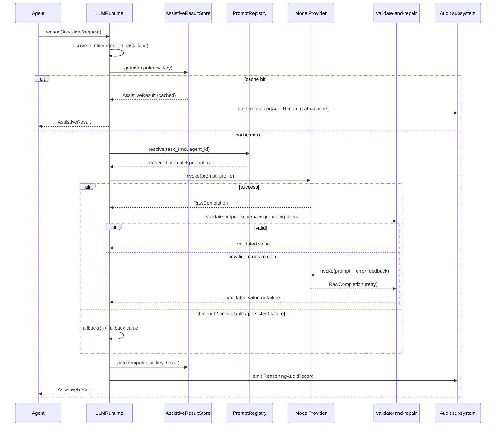

# Agent LLM Runtime — Architecture Overview

Authoritative sources: `specs/008-agent-llm-runtime/plan.md`,
`specs/008-agent-llm-runtime/contracts/llm-runtime-api.md`,
`specs/008-agent-llm-runtime/data-model.md`.

## Purpose

The shared assistive LLM runtime (`src/agent_foundation/llm/`) gives any agent a single in-process
entry point for bounded reasoning tasks -- classify, extract intent, draft a customer message,
summarize reasoning -- returning a grounded, schema-validated, prompt-cached, fully audited result.

The LLM is **assistive, never authoritative**. Every binding refund verdict stays the output of the
existing deterministic engines:

| Agent | Binding engine | LLM assists with |
|-------|---------------|------------------|
| Customer Resolution | `decision_engine.decide` | classify, draft_response |
| Billing Entitlement | `rules_engine.evaluate` | summarize_reasoning |
| Risk & Fraud | `scoring.assess_signals` | summarize_reasoning |

## Single entry point

```python
from agent_foundation.llm import build_runtime, AssistiveRequest

runtime = build_runtime()           # stub by default, no AWS
result  = await runtime.reason(request)   # -> AssistiveResult
```

`LLMRuntime.reason(request: AssistiveRequest) -> AssistiveResult` is the only call site an agent
uses. The `build_runtime()` factory assembles the provider, idempotency store, config, and optional
audit publisher.

## Ordered flow

Every call follows this sequence:

1. **Profile resolution** -- `resolve_profile(agent_id, task_kind)` selects the `ModelProfile` from
   the YAML config, in-code registry, or env-var overrides.
2. **Idempotency lookup** -- the `AssistiveResultStore` (LRU + compacted Kafka topic) checks whether
   an identical `idempotency_key` has already been served. If yes, the cached `AssistiveResult` is
   returned with `reasoning_path=cache` and zero model invocations.
3. **Prompt render** -- the `PromptRegistry` resolves a versioned `PromptTemplate` for the
   `(task_kind, agent_id)` pair; the stable prefix (body + schema + examples) is cache-eligible and
   the variable suffix (grounding inputs) changes per call.
4. **Provider invoke** -- the configured `ModelProvider` (stub, bedrock, or agentcore) is called with
   a timeout from the profile.
5. **Validate-and-repair** -- the raw text is parsed as JSON, validated against `output_schema`
   (Pydantic), and checked against grounding inputs. On failure, `invoke_structured` retries with
   error feedback up to `max_repairs` times.
6. **Fallback** -- if the model is unreachable, times out, or output is persistently invalid, a
   caller-supplied `fallback()` value is returned with `reasoning_path=fallback` and a recorded
   `failure_reason`. The binding verdict is unaffected.
7. **Store + audit** -- the valid result is persisted to the idempotency store, and a
   `ReasoningAuditRecord` is emitted through the existing audit subsystem.



## Assistive-never-authoritative boundary

The runtime enforces this boundary structurally:

- `AssistiveResult.value` is typed as `Any` (a Pydantic model); it carries suggestions, drafts,
  classifications, and summaries -- never a binding verdict.
- The `PromptTemplate` for `summarize_reasoning` tasks sets `allows_final_recommendation=false`;
  the registry rejects templates that violate this.
- Each agent's binding engine (`decide`, `evaluate`, `assess_signals`) runs independently of the
  LLM result. Tests force the stub to emit contradictory "decisions" and assert the binding verdict
  is unchanged.

## Package layout

```
src/agent_foundation/llm/
  __init__.py          # public API re-exports
  runtime.py           # LLMRuntime.reason() + assist_or_fallback convenience
  factory.py           # build_runtime() assembly
  request.py           # AssistiveRequest, TaskKind enum
  result.py            # AssistiveResult, ReasoningPath, TokenUsage, TextResult
  config.py            # RuntimeConfig, ModelProfile, resolve_profile, load_model_config
  structured.py        # invoke_structured validate-and-repair loop
  audit.py             # ReasoningAuditRecord, build_audit_record, write_reasoning_audit
  audit_events.py      # Optional LlmInvocationCompleted/Failed payloads
  store.py             # AssistiveResultStore (LRU + compacted Kafka)
  prompts.py           # PromptTemplate, PromptRegistry
  redaction.py         # PII redaction (Redactor, redact_text)
  errors.py            # FailureReason, LLMRuntimeError hierarchy
  client.py            # AgentLLM thin Bedrock wrapper
  langgraph.py         # as_node(), create_langgraph_llm_node()
  pricing.py           # Token usage tracking and cost estimation
  providers/
    __init__.py        # select_provider()
    base.py            # ModelProvider protocol, RawCompletion, ProviderError
    stub.py            # Deterministic offline stub (default)
    bedrock.py         # AWS Bedrock via boto3
    agentcore.py       # Local AgentCore dev mode
```

## Three agent adoptions

All three agents call the runtime in-process. No new agent, event contract, topic, or supervisor is
introduced (FR-015).

### Customer Resolution Agent

- **classify** -- classifies the incoming ticket (refund vs. direct response). The binding triage
  decision uses `decision_engine.decide`.
- **draft_response** -- drafts a customer-facing message after the combined decision. The draft is
  assistive text, not a binding verdict.

### Billing Entitlement Agent

- **summarize_reasoning** -- produces a human-readable summary of the billing eligibility analysis.
  The binding eligibility check uses `rules_engine.evaluate`.

### Risk & Fraud Agent

- **summarize_reasoning** -- produces a human-readable summary of the risk assessment. The binding
  risk score uses `scoring.assess_signals`.

## Related docs

- [bedrock-local-config.md](./bedrock-local-config.md) -- provider config and offline-to-Bedrock switch
- [structured-llm-outputs.md](./structured-llm-outputs.md) -- schema enforcement and grounding
- [llm-audit-events.md](./llm-audit-events.md) -- reasoning audit and replay
- [agentcore-local-bedrock.md](./agentcore-local-bedrock.md) -- local AgentCore mode
- [replay-and-idempotency.md](./replay-and-idempotency.md) -- the three idempotency layers (the LLM
  runtime adds a fourth: assistive-result idempotency by key)
