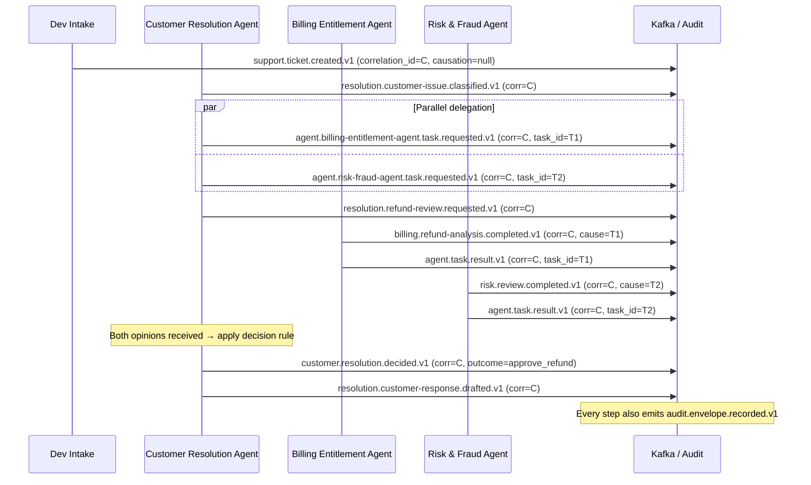

# Decentralized Workflow: End-to-End Refund Flow

Authoritative sources: `specs/006-workflow-choreography/spec.md` §Overview,
`specs/006-workflow-choreography/contracts/choreography.md`.

## Overview

A refund support ticket enters the system and a single terminal decision — approve, deny, or escalate to
a human — comes out the other end. The entire journey is orchestrated by **no central supervisor**: four
participants coordinate solely through Kafka events, each acting on its own domain.

## Four participants and their roles

| Participant | Identity | Responsibility |
|---|---|---|
| **Dev intake** | `apps/api/dev_publish_ticket.py` | Publishes the root `support.ticket.created` event. Not an agent; not a router. |
| **Customer Resolution Agent** | `customer-resolution-agent` | Triage, peer delegation, async opinion aggregation, combined decision, timeout reaper (its own cases only). |
| **Billing Entitlement Agent** | `billing-entitlement-agent` | Responds to A2A task requests with a billing-eligibility opinion (`analyze_refund_eligibility`). Publishes its own result event. |
| **Risk & Fraud Agent** | `risk-fraud-agent` | Responds to A2A task requests with a fraud-risk opinion (`assess_fraud_risk`). Publishes its own result event. |

The resolution agent is a **peer** that requests opinions and aggregates them — not a supervisor that
directs the billing or risk agents. See `specs/006-workflow-choreography/contracts/choreography.md`
§Decentralization invariants.

## Refund happy path

1. **Intake**: Dev intake publishes `local.support.ticket.created.v1` with a new `correlation_id` (the
   case id). This is the root event (`causation_id = null`).
2. **Triage**: The resolution agent's intake loop receives the ticket, classifies it, and emits
   `resolution.customer-issue.classified.v1`.
3. **Parallel delegation**: The resolution agent sends two A2A task requests concurrently — one to the
   billing endpoint topic and one to the risk endpoint topic. Both carry the same `correlation_id`.
   A `resolution.refund-review.requested.v1` marker is emitted.
4. **Peer processing**: Billing and risk agents independently process their requests and each publishes
   its own domain result event (`billing.refund-analysis.completed.v1` and `risk.review.completed.v1`)
   plus a shared `agent.task.result.v1` on the A2A result stream.
5. **Aggregation**: The resolution agent's result loops receive the two opinions (in any order), match
   them to the case by `correlation_id` / `task_id`, and apply the decision rule once both slots are
   filled.
6. **Decision**: A single `customer.resolution.decided.v1` is emitted with outcome
   (`approve_refund`, `deny_refund`, or `escalate_human`), explanation, and the contributing opinions.
7. **Draft**: A `resolution.customer-response.drafted.v1` follows. Case is terminal.
8. **Audit**: Every step above triggers an `audit.envelope.recorded.v1` entry on the audit topic, linking
   actor, `correlation_id`, `causation_id`, and outcome.

## Non-refund direct-response path

When triage determines `needs_refund_review == False` (steps 1–2), the resolution agent emits
`customer.resolution.decided.v1` with outcome `direct_response` and a drafted response — billing and
risk agents are **not invoked** (FR-002). Case closes immediately.

## Happy-path sequence diagram

## No central orchestrator

The choreography is **emergent**: no component holds a routing table of which agents to call or
coordinates the workflow on behalf of all three agents. The resolution agent requests peer opinions as
part of its own case-handling responsibility; the billing and risk agents react to their endpoint topics
autonomously. Structural enforcement: `apps/agents/customer_resolution/tests/test_no_supervisor.py`
and `tests/integration/test_no_router.py` (FR-021, Constitution Principle I).

## Related docs

- [event-choreography.md](./event-choreography.md) — topic topology and correlation rules
- [failure-handling.md](./failure-handling.md) — timeout reaper and failure paths
- [replay-and-idempotency.md](./replay-and-idempotency.md) — idempotency layers and replay harness
- [no-supervisor-verification.md](./no-supervisor-verification.md) — structural proof of decentralization
