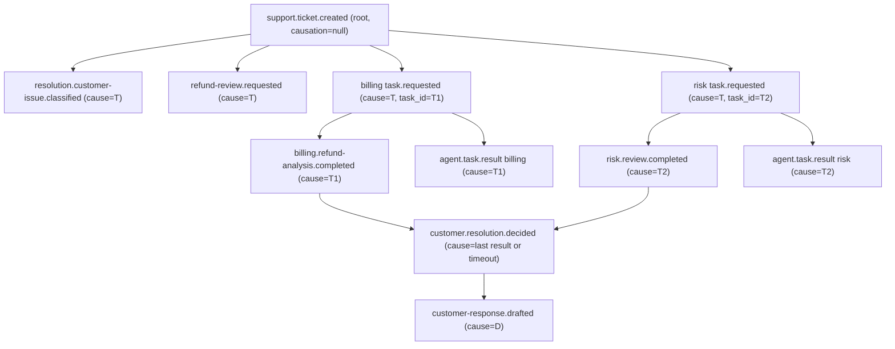

# Event Choreography

Authoritative source: `specs/006-workflow-choreography/contracts/choreography.md`.
Topic constants: `packages/contracts/topics.py`.

## Topic topology

All topic names are resolved at runtime by `packages/contracts/topics.py::topic_for(domain, entity, action)`
using the `AGENT_ENVIRONMENT` env var (default `"local"`). Changing `AGENT_ENVIRONMENT` to `staging` or
`prod` transparently re-keys every topic. No new topics are introduced in feature 006.

| # | Topic constant | Resolved name (default `local`) | Emitter | Consumer(s) | Purpose |
|---|---|---|---|---|---|
| 1 | `topic_for("support","ticket","created")` | `local.support.ticket.created.v1` | dev intake | resolution intake loop | Root ticket — starts a case |
| 2 | `TOPIC_ISSUE_CLASSIFIED` | `local.resolution.customer-issue.classified.v1` | resolution | observability | Triage outcome marker |
| 3 | `endpoint_topic("billing-entitlement-agent")` | `local.agent.billing-entitlement-agent.task.requested.v1` | resolution | billing runtime | A2A billing opinion request |
| 3'| `endpoint_topic("risk-fraud-agent")` | `local.agent.risk-fraud-agent.task.requested.v1` | resolution | risk runtime | A2A risk opinion request |
| 4 | `TOPIC_REFUND_REVIEW_REQUESTED` | `local.resolution.refund-review.requested.v1` | resolution | observability | Refund case opened marker |
| 5 | `TOPIC_BILLING_RESULT` | `local.billing.refund-analysis.completed.v1` | billing | resolution billing-results loop | Billing opinion result |
| 5'| `TOPIC_RISK_RESULT` | `local.risk.review.completed.v1` | risk | resolution risk-results loop | Risk opinion result |
| 5"| `TOPIC_TASK_RESULT` | `local.agent.task.result.v1` | billing & risk runtimes | resolution results loop | Shared A2A task result stream |
| 6 | `TOPIC_RESOLUTION_DECIDED` | `local.customer.resolution.decided.v1` | resolution | observability / trace | Terminal case decision |
| 7 | `TOPIC_RESPONSE_DRAFTED` | `local.resolution.customer-response.drafted.v1` | resolution | observability | Customer-facing response |
| A | `TOPIC_AUDIT` | `local.audit.envelope.recorded.v1` | every agent, every step | trace tool | Structured audit trail |

`endpoint_topic(agent_id)` is defined as `topic_for("agent", agent_id, "task.requested")`.

## How topic names resolve

```python
# packages/contracts/topics.py
AGENT_ENVIRONMENT = os.environ.get("AGENT_ENVIRONMENT", "local")

def topic_for(domain, entity, action, version="1", environment=None):
    env = environment if environment is not None else AGENT_ENVIRONMENT
    return f"{env}.{domain}.{entity}.{action}.v{version}"
```

A producer or consumer that calls `topic_for(...)` at import time picks up the active environment.
Replay tests override this via env var injection so consumer groups are unique and offsets start fresh.

## Correlation and causation propagation (FR-005, FR-006, FR-007)

Every event in a case carries the **same** `correlation_id` minted at ticket intake. Receivers never
re-key the correlation id — it is propagated unchanged by the `EventEnvelope` invariant.

Every non-root event sets `causation_id` to the `event_id` (or `task_id`) of the event that immediately
triggered it. This forms a single causation DAG per case, from which the full causal trace can be
reconstructed (see `specs/006-workflow-choreography/contracts/replay-and-trace.md`).

Opinion results are matched to their case by **two independent keys**:
- `correlation_id` — shared across all events of the case (domain result events)
- `task_id = uuid5(correlation_id, capability)` — stable, deterministic, derived from the case id
  (A2A `TaskResult`)

## Async result aggregation across the shared task.result stream

Both billing and risk publish to `TOPIC_TASK_RESULT` (the shared A2A stream). The resolution agent
subscribes to this stream and maintains a per-case slot map in `InMemoryCaseStateStore`:

```
case(correlation_id)
  ├── billing_slot: None | OpinionResult
  └── risk_slot:    None | OpinionResult
```

When a result arrives, the agent matches it to the correct slot using `task_id`. The decision is
applied (`_apply_decision`) only when **both** slots are filled or a timeout/failure has been declared.
Many cases can be in flight simultaneously — there is no cross-case state sharing.

## Correlation/causation DAG



Every node above also produces an `audit.envelope.recorded.v1` (not shown to reduce clutter) with
`causation_id` pointing back to the node's own `event_id`.

## Related docs

- [decentralized-workflow.md](./decentralized-workflow.md) — narrative flow and sequence diagram
- [replay-and-idempotency.md](./replay-and-idempotency.md) — idempotency and replay
- [topic-naming.md](./topic-naming.md) — naming conventions and registration steps
